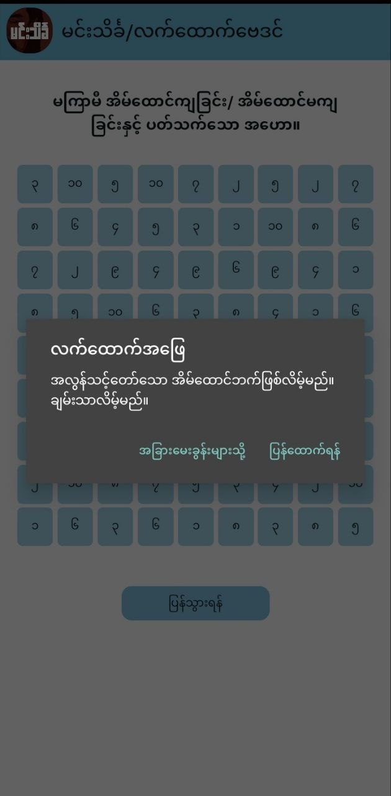

## How the App Works

1. **Browse Questions 📜:**

   - View the list of questions available.
   - Utilize the search bar 🔍 to find specific questions quickly.

2. **Pagination Navigation 📄:**

   - Navigate through the pagination below the question list for easier exploration.


3. **Select a Question 🖱️:**
   - Click on a question to explore further.


4. **Fortune Telling Graph 📊:**

   - Upon selecting a question, you will be redirected to a fortune-telling graph.


5. **Choose a Number 🔢:**

   - Close your eyes 😌 and click on one of the numbers on the graph.

6. **Receive Answer 🎉:**

   - An alert modal will appear, revealing the answer corresponding to the selected number.



7. **Retry or Explore 🔄:**

   - Decide whether to try again with a different number or go back to the list to explore other questions.

8. **Have Fun 🎉:**
   - Enjoy the experience and have fun with the app!

# How to Run the App

> **Note**: Make sure you have completed the [React Native - Environment Setup](https://reactnative.dev/docs/environment-setup) instructions till "Creating a new application" step, before proceeding.

## Step 1: Start the Metro Server

First, you will need to start **Metro**, the JavaScript _bundler_ that ships _with_ React Native.

To start Metro, run the following command from the _root_ of your React Native project:

```bash
# using npm
npm start

# OR using Yarn
yarn start
```

## Step 2: Start your Application

Let Metro Bundler run in its _own_ terminal. Open a _new_ terminal from the _root_ of your React Native project. Run the following command to start your _Android_ or _iOS_ app:

### For Android

```bash
# using npm
npm run android

# OR using Yarn
yarn android
```

### For iOS

```bash
# using npm
npm run ios

# OR using Yarn
yarn ios
```

If everything is set up _correctly_, you should see your new app running in your _Android Emulator_ or _iOS Simulator_ shortly provided you have set up your emulator/simulator correctly.

This is one way to run your app — you can also run it directly from within Android Studio and Xcode respectively.

## Congratulations! :tada:

You've successfully run and modified Min Thein Kha Fortune-telling App. :partying_face:

## Credit 💡

This project idea comes from [@sannlynnhtun-coding](https://github.com/sannlynnhtun-coding). 🙌

Special Thanks 🌟 to [@sannlynnhtun-coding](https://github.com/sannlynnhtun-coding) for the inspiration and project concept!

The JSON data can be found at [MinTheinKha-LatHtaukBayDin](https://github.com/sannlynnhtun-coding/MinTheinKha-LatHtaukBayDin), where you can try it out for yourself! 🚀
